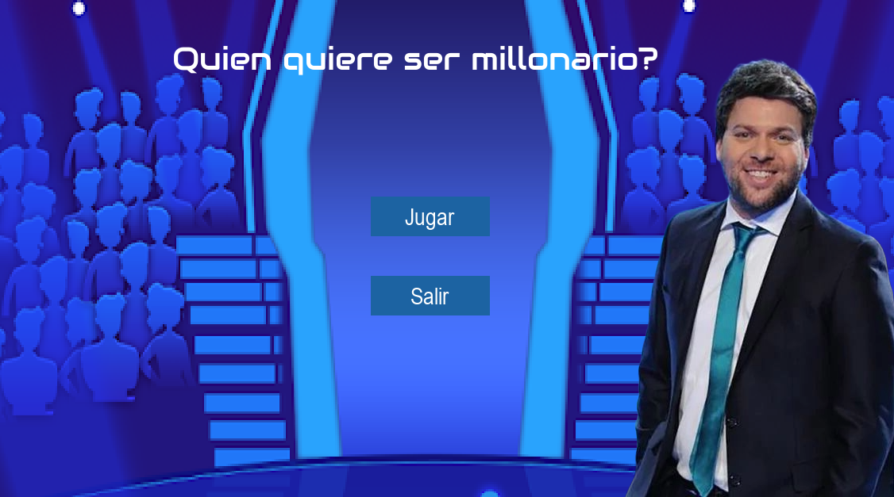

# Segundo parcial Programacion 1 Div 311 Acosta Bordon

## ¿Quien quiere ser milonario?
Bienvenidos al reconocido juego "QUIEN QUIERE SER MILLONARIO", en esta edición UTN. Conducido por el icónico Guido Kaczka.
Deberán responder 15 preguntas de manera correcta y consecutiva para llevarse el premio gordo, u optar por retirarse en algún punto seguro.

**Menu Principal**

**Pantalla de Juego**

Cuenta con la ayuda de 3 comodines distintos (un uso cada uno) para responder las preguntas.
Comodín "público": Consulta a toda la gente presente en el programa cuál opinan que es la opción correcta, y muestra un gráfico de barras con respecto a los resultados.
Comodín "llamada telefónica": Permite hacer un amigo o familiar para que los ayude con una pista sobre la respuesta correcta.
Comodín "50-50": Reduce la cantidad de posibles respuestas desde 4 a 2.
**Comodines**

**Cronometro**

Deberá apresurarse y pensar rápido, ya que cuenta con tan solo 30 segundos para responder cada pregunta

